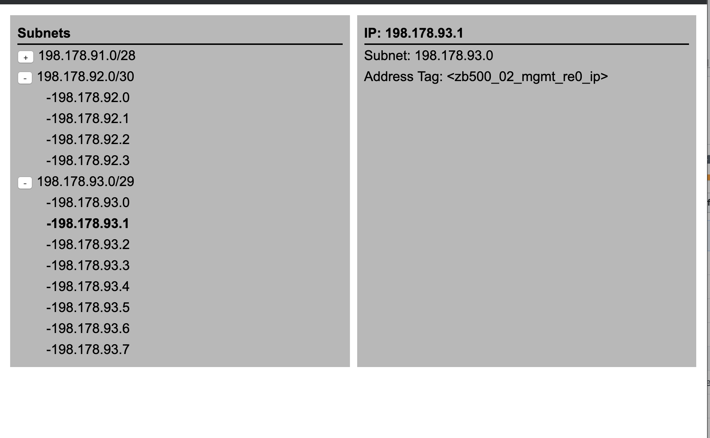

Subnet Demo
==============================

Uses Symfony 4 and Angular 7.

Once you have cloned the repo and have your dev environment up you can seed the data by running the command: `php bin/console subnet:load`

If you browse to the project url you should see the following but with subnets closed:

Simply click on the + next to each subnet to open the list of their respective ips.

Click on an ip to see it's information in a pane to the right.

Happy clicking!
